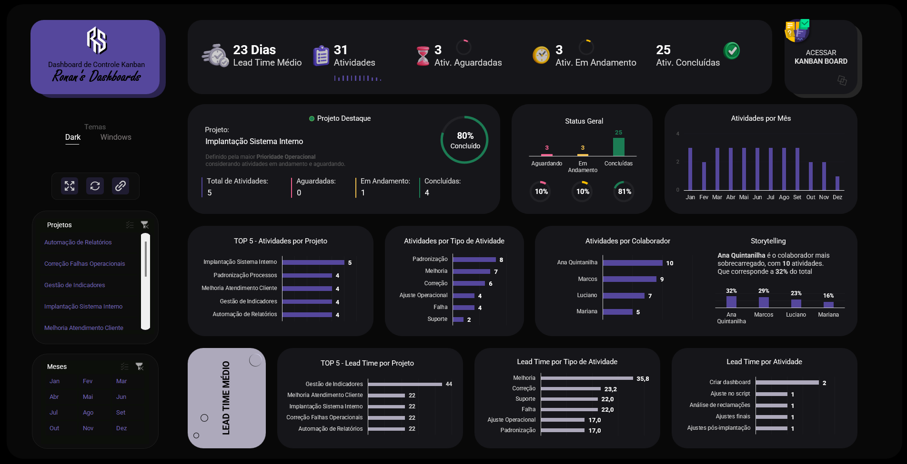
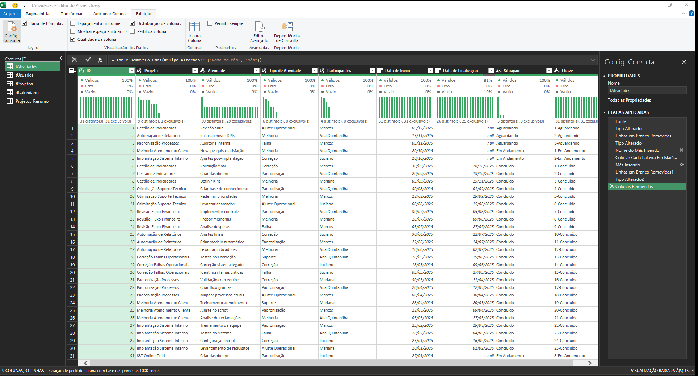
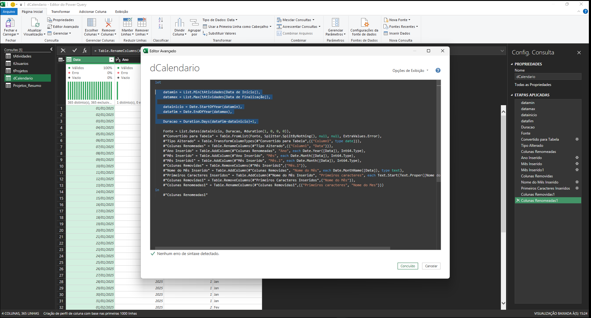
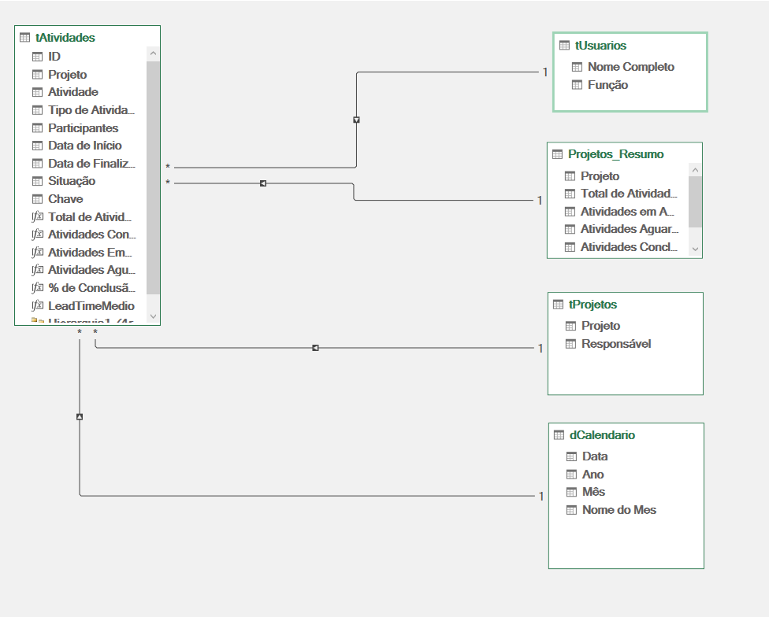
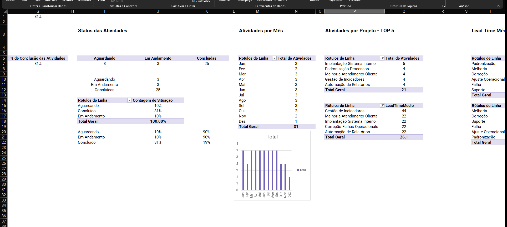
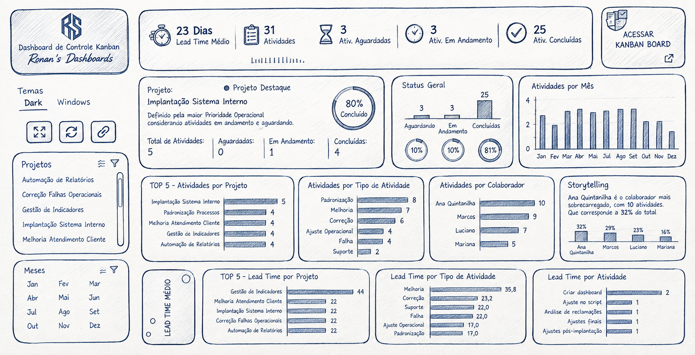

# Dashboard Kanban Board — Excel

Dashboard interativo desenvolvido no Microsoft Excel para acompanhamento e análise de tarefas em uma estrutura visual inspirada em **Kanban Boards**.

---

## 1. Preview



---

## 2. Overview

Projeto desenvolvido para demonstrar a aplicação de recursos avançados do Excel na construção de uma solução de análise e acompanhamento de tarefas.

O dashboard integra **Power Query, Power Pivot e DAX** em um fluxo de tratamento, modelagem e visualização de dados.

A interface foi planejada com princípios de **UI/UX**, priorizando hierarquia visual, usabilidade e leitura rápida dos principais indicadores.

O usuário pode utilizar filtros interativos para explorar as informações por diferentes dimensões.

---

## 3. Dados > Dashboard

O projeto utiliza o **Power Query** para preparação dos dados que alimentam o modelo analítico.

### Fluxo de Dados

```text
Base de Dados
      │
      ▼
Power Query
      │
      ▼
Modelo de Dados
      │
      ▼
Tabelas Dinâmicas
      │
      ▼
Dashboard
```

### Base de Dados

Consulta desenvolvida no Power Query para estruturar os dados utilizados no projeto.



---

## 4. Tabela dCalendário

Dimensão de calendário criada diretamente no **Power Query** para suportar as análises relacionadas a períodos.

Principais campos:

* Data
* Ano
* Mês



---

## 5. Modelagem de Dados — Power Pivot

As tabelas foram carregadas no **Modelo de Dados do Excel** e relacionadas utilizando o Power Pivot.

Os relacionamentos estruturam a conexão entre as tabelas utilizadas nas análises.



---

## 6. Tabelas Dinâmicas

As **Tabelas Dinâmicas** foram utilizadas para organizar os dados provenientes do modelo e alimentar os componentes analíticos do dashboard.



---

## 7. Esboço do Dashboard

O layout foi planejado previamente por meio de um esboço, definindo a distribuição dos componentes e a hierarquia das informações.

O planejamento considerou:

* Hierarquia visual
* Posicionamento dos indicadores
* Organização dos filtros
* Fluxo de leitura em **Z**
* Usabilidade



---

## 8. Arquitetura da Solução

O projeto segue uma estrutura composta por cinco camadas:

```text
                         DADOS
                           │
                           ▼
                    ┌─────────────┐
                    │ POWER QUERY │
                    └─────────────┘
                           │
                           ▼
                    ┌─────────────┐
                    │ POWER PIVOT │
                    └─────────────┘
                           │
                           ▼
                       ┌───────┐
                       │  DAX  │
                       └───────┘
                           │
                           ▼
                ┌───────────────────┐
                │ TABELAS DINÂMICAS │
                └───────────────────┘
                           │
                           ▼
                  ┌────────────────┐
                  │   DASHBOARD    │
                  └────────────────┘
```

| Camada                | Responsabilidade          |
| --------------------- | ------------------------- |
| **Power Query**       | Preparação dos dados      |
| **Power Pivot**       | Modelo e relacionamentos  |
| **DAX**               | Medidas e cálculos        |
| **Tabelas Dinâmicas** | Estruturação das análises |
| **Dashboard**         | Visualização e interação  |

---

## 9. Ferramentas e Skills

| Tecnologia / Skill       | Aplicação                    |
| ------------------------ | ---------------------------- |
| **Microsoft Excel**      | Desenvolvimento da solução   |
| **Power Query**          | ETL e transformação de dados |
| **Power Pivot**          | Modelagem e relacionamentos  |
| **DAX**                  | Medidas e cálculos           |
| **Segmentação de Dados** | Interatividade e filtros     |
| **UI/UX Design**         | Layout e experiência de uso  |

---

## 10. Estrutura do Projeto

```text
Dashboard-Kanban-Board/
│
├── dashboard.png
├── base-dados.png
├── dcalendario.png
├── relacionamentos.png
├── tabelas-dinamicas.png
├── esboco-dashboard.png
│
└── README.md
```

---

## 11. Resultado

Solução de análise desenvolvida inteiramente no Excel, integrando **tratamento de dados, modelagem, cálculos, visualização e interatividade** em um único projeto.

O projeto demonstra a aplicação prática dos principais recursos do Excel para construção de uma solução de análise de dados.
